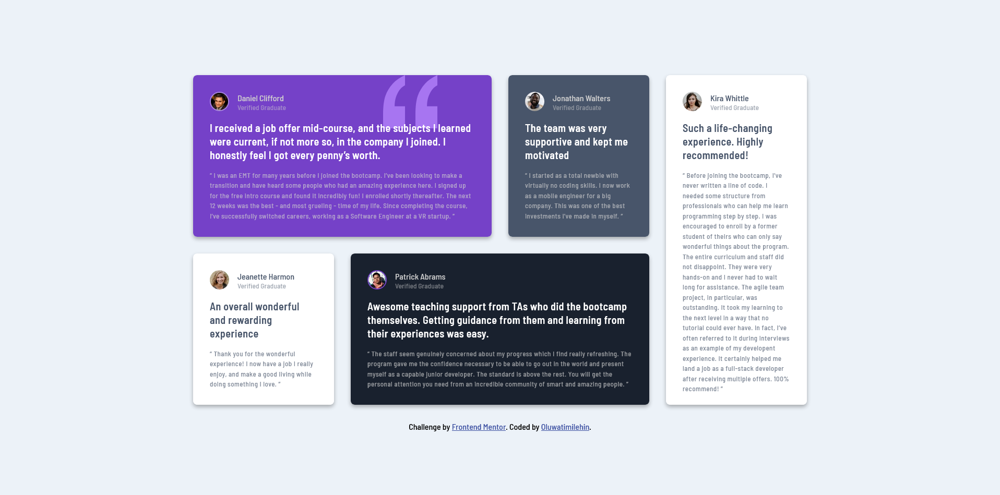

# Frontend Mentor - Testimonials grid section solution

This is a solution to the [Testimonials grid section challenge on Frontend Mentor](https://www.frontendmentor.io/challenges/testimonials-grid-section-Nnw6J7Un7). Frontend Mentor challenges help you improve your coding skills by building realistic projects.

## Table of contents

- [The challenge](#the-challenge)
- [Screenshots](#screenshot)
- [Links](#links)
- [My process](#my-process)
  - [Built with](#built-with)
  - [What I learned](#what-i-learned)
  - [Useful resources](#useful-resources)
- [Author](#author)

### The challenge

Users should be able to:

- View the optimal layout for the site depending on their device's screen size

### Screenshot




### Links

- Solution URL: [Add solution URL here](https://your-solution-url.com)
- Live Site URL: [https://testimonial-grid-design.netlify.app]

## My process

I started this project by structuring my HTML first, determining what the content of the project would be and how many containers and sub-containers I would require.
Then I moved on to creating a list of some "global variables" which I resused in the entire project after which I designed the mobile layout using SCSS for my whole stylying and making use of modules which allowed me break up my code into lego blocks.

### Built with

- Semantic HTML5 markup
- CSS custom properties
- CSS Grid
- Mobile-first workflow
- [SCSS](https://sass-lang.com/) - For Styles

### What I learned

Engaging in this project reminded me of how to make use of mixins for different purposes like a media query and then using the @include statment also I was able to practice nesting which is one of the most beautiful features of SASS.

Snippet of a single card structure:

```html
<article class="grid grid-3">
  <div class="comment-author">
    <div class="author-img-container">
      
    </div>
    <div class="author-info">
      <p>jeanette harmon</p>
      <p>verified graduate</p>
    </div>
  </div>
  <div class="testimonial">
    <h1>An overall wonderful and rewarding experience</h1>
    <p>
      “ Thank you for the wonderful experience! I now have a job I really enjoy,
      and make a good living while doing something I love. ”
    </p>
  </div>
</article>
```

Snippet of media query using a mixin for media query:

```scss
@mixin desktop {
  @media screen and (min-width: 1400px) {
    @content;
  }
}
```

### Useful resources

- [W3schools](https://www.w3schools.com/sass/sass_mixin_include.asp) - This resource helped me understand how mixins in SASS works and how I can create resuable mixins throughout my projects.

## Author

- Instagram - [Oluwatimilehin](https://www.instagram.com/_teamie_/)
- Frontend Mentor - [@coder-teamie](https://www.frontendmentor.io/profile/coder-teamie)
- Twitter - [@teamie\_\_](https://twitter.com/teamie__)
